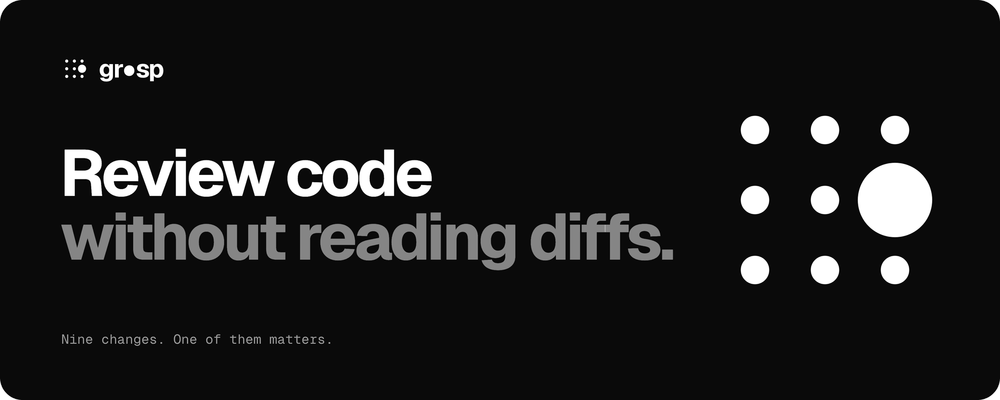
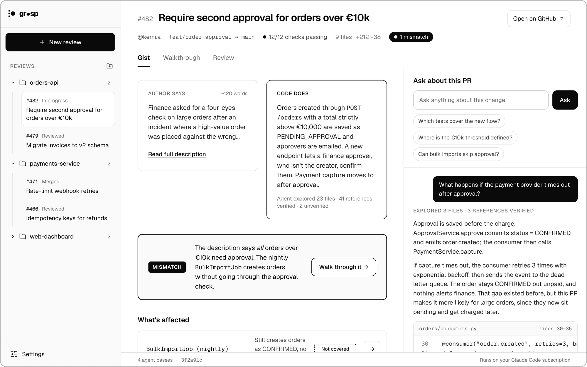
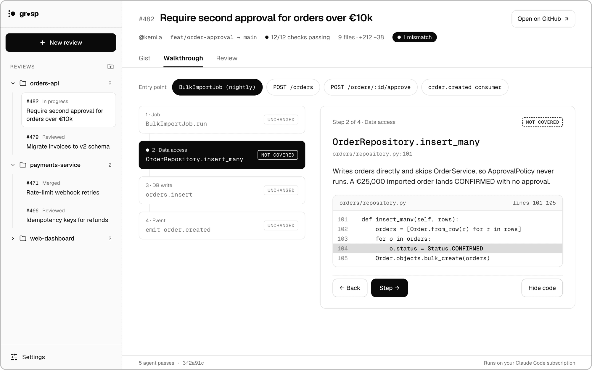
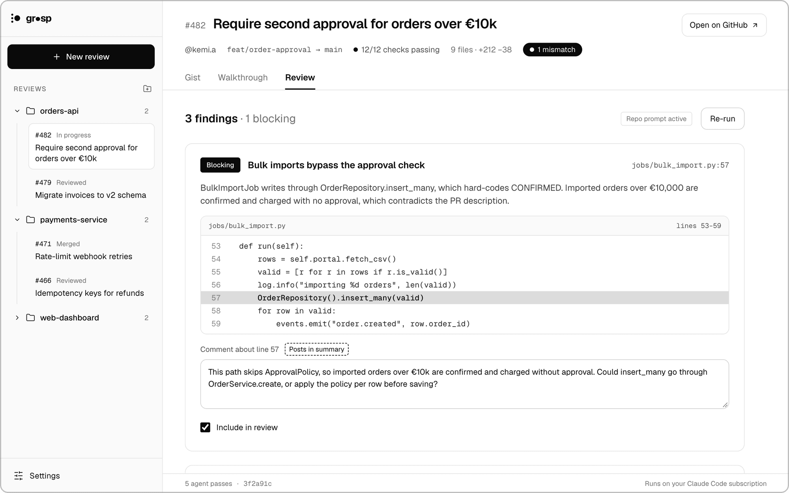
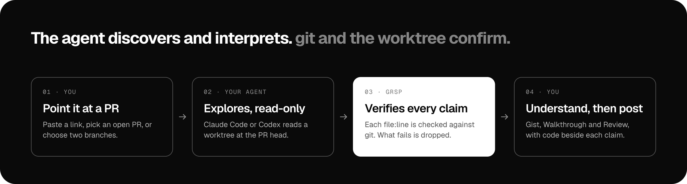

<p align="center">
  <a href="https://grsp.app">
    
  </a>
</p>

<p align="center">
  <b>grsp is a macOS app that shows you what a pull request does, not just which lines moved.</b><br />
  It runs on the Claude Code or Codex subscription you already have. No API keys.
</p>

<p align="center">
  <a href="https://github.com/Ghvstcode/grsp/releases/latest/download/grsp_aarch64.dmg"></a>
  &nbsp;
  <a href="https://github.com/Ghvstcode/grsp/releases/latest/download/grsp_x64.dmg"></a>
</p>

<p align="center">
  <a href="https://grsp.app">Website</a> &nbsp;·&nbsp;
  <a href="https://grsp.app/docs">Docs</a> &nbsp;·&nbsp;
  <a href="https://grsp.app/changelog">Changelog</a> &nbsp;·&nbsp;
  <a href="#build-from-source">Build from source</a>
</p>

<p align="center">
  <a href="https://github.com/Ghvstcode/grsp/releases/latest"></a>
  <a href="https://github.com/Ghvstcode/grsp/actions/workflows/lint-and-format.yml"></a>
  <a href="./LICENSE"></a>
  
</p>

---

A diff tells you which lines changed. It doesn't tell you what the system does differently now, which paths the author forgot, or whether the description is still true.

Point grsp at a pull request and your own coding agent reads the change in a read-only worktree. Then grsp checks every claim the agent makes against git before any of it reaches your screen. You get the behaviour, with the code beside it as proof.

## What you get

### Gist

What the author says, next to what the code does. If they disagree, that is the first thing you see.

<p align="center">
  
</p>

Below that: every entry point whose behaviour changes, the ones the PR should have touched and didn't, questions to test your understanding, the GitHub discussion, and an Ask panel that answers with code excerpts and `file:line` references.

### Walkthrough

Step through the changed behaviour block by block, from the entry point to the database write. Try "what if" inputs to see which path they take.

<p align="center">
  
</p>

### Review

Run an AI review with your own prompt. Edit the findings, choose which to include, pick a verdict and post it to GitHub as a normal review.

<p align="center">
  
</p>

### Code and notes

The Code tab shows the whole diff, file by file, in split or unified view. Pin private notes to a line or a walkthrough step and export them as Markdown.

<sub>Screenshots are the app running on its built-in fixture scenario. You can open the same screens yourself with <a href="#build-from-source">fixture mode</a>.</sub>

## How it works

<p align="center">
  
</p>

1. **Point it at a change.** Paste a GitHub PR link, pick from a repo's open PRs, choose two branches, or pick commits on a branch: one commit, or everything since you last looked. If you don't have the repo locally, grsp offers to clone it.
2. **Your agent explores.** grsp fetches the refs, checks out a detached worktree at the PR head and runs Claude Code or Codex against it in read-only mode.
3. **grsp verifies.** Every `file:line` the agent returns is matched against the worktree. A reference that is a few lines off is snapped to the right line; one that can't be found is dropped.
4. **You read the result.** Each section appears as soon as it is ready, and tells you how much was explored, verified and left unverified.

The whole design follows one rule:

> **The agent discovers and interprets. git and the worktree confirm.**

Change status, line numbers, code excerpts, comment threads and CI never come from agent output.

## Why it's different

- **It can't show you code that isn't there.** Locations are verified, excerpts are read from disk, and New / Changed / Unchanged is computed from the diff, never taken from the model. Mismatches and findings with no verified reference are not shown.
- **It finds what the PR left out.** The most useful thing in a review is often the code path nobody touched. grsp lists those as "Not covered".
- **Any language.** There is no parser and no list of supported frameworks. If your agent can read the code, grsp can verify what it says about it.
- **No API keys.** grsp shells out to the `claude` or `codex` CLI you are already signed in to. It never asks for, uses or stores a model key.
- **It doesn't touch your working copy.** The worktree lives in grsp's own data folder. Your branches and uncommitted work stay as they are.
- **It spends your subscription carefully.** Results are cached by head commit, walkthroughs run when you open them, and nothing re-runs unless you ask.

The eval suite runs the real pipelines against four fixture PRs in Python, TypeScript, Go and YAML/SQL. On the latest run with Claude Code, 280 code references were verified and 0 were dropped. Run it yourself with `pnpm eval`.

## Quick start

1. Download grsp for [Apple silicon](https://github.com/Ghvstcode/grsp/releases/latest/download/grsp_aarch64.dmg) or [Intel](https://github.com/Ghvstcode/grsp/releases/latest/download/grsp_x64.dmg), open the `.dmg` and drag grsp into Applications.
2. Make sure you have [Claude Code](https://docs.anthropic.com/en/docs/claude-code) or [Codex](https://developers.openai.com/codex/cli) installed and signed in. One is enough.
3. For pull requests, install the [GitHub CLI](https://cli.github.com) and run `gh auth login`. Without it you can still compare two branches.
4. Open grsp. Onboarding finds your agent, checks GitHub and asks for a repo folder. Then paste a PR link.

The [Getting Started guide](https://grsp.app/docs#getting-started) covers each step in more detail.

## Build from source

You need macOS, Node.js 22 or newer, pnpm and stable Rust.

```bash
git clone https://github.com/Ghvstcode/grsp.git
cd grsp
pnpm install
pnpm tauri:dev
```

No agent or GitHub account to hand? Fixture mode renders every screen from a built-in scenario:

```bash
VITE_GRSP_FIXTURES=1 pnpm tauri:dev    # in the app
VITE_GRSP_FIXTURES=1 pnpm vite:dev     # in a browser, at localhost:1420
```

Checks and tests:

```bash
pnpm validate    # lint, format check and typecheck
pnpm test        # frontend tests (Vitest)
cargo test --manifest-path src-tauri/Cargo.toml    # Rust unit and contract tests
pnpm eval        # run the real pipelines on the fixture PRs and score them
```

`pnpm eval` uses your own agent subscription, so it is local and on demand, never part of CI. See [evals/README.md](./evals/README.md).

grsp is built with [Tauri 2](https://v2.tauri.app), React and Rust. The Rust core has five modules: `git`, `verify`, `agent`, `pipelines` and `github`. Every pipeline is the same shape: build the prompt, run the agent, parse, verify, persist. [docs/architecture.md](./docs/architecture.md) has the full picture.

## Privacy

- **Your code stays on your Mac.** It is read from a local worktree, and the only place it goes is your own Claude Code or Codex, under the terms you already have with that provider. The agent runs read-only.
- **Nothing is posted until you press Post.** GitHub is reached through `gh` with your account. Analyses and history live in a SQLite database on your disk.
- **Usage metrics are anonymous and optional.** grsp's server handles sign-in and records which features are used and whether analyses finish. It never receives repository names, code, diffs, PR titles, questions, comments or agent output. Turn metrics off in Settings → General.

More in the [privacy section of the docs](https://grsp.app/docs#privacy).

## FAQ

**Can the agent be wrong?**
Yes. It can misread code like any reviewer. What it can't do is show you a location that doesn't exist or call unchanged code changed. Treat its notes as a well-read colleague's explanation, and the code beside them as the fact.

**How much of my subscription does a review use?**
A handful of agent passes per PR. The session footer shows the count, and nothing runs in the background.

**Can I use it without GitHub?**
Yes. Choose two branches as base and head. You get the Gist, Ask, walkthroughs and the AI review. There is no discussion and no posting.

**Does it work on Windows or Linux?**
Not today. grsp is a macOS app.

More answers in the [docs FAQ](https://grsp.app/docs#faq).

## Contributing

Issues and pull requests are welcome. [CONTRIBUTING.md](./CONTRIBUTING.md) has the setup, the conventions and the one rule every change has to respect.

## License

[GPL-2.0](./LICENSE)
